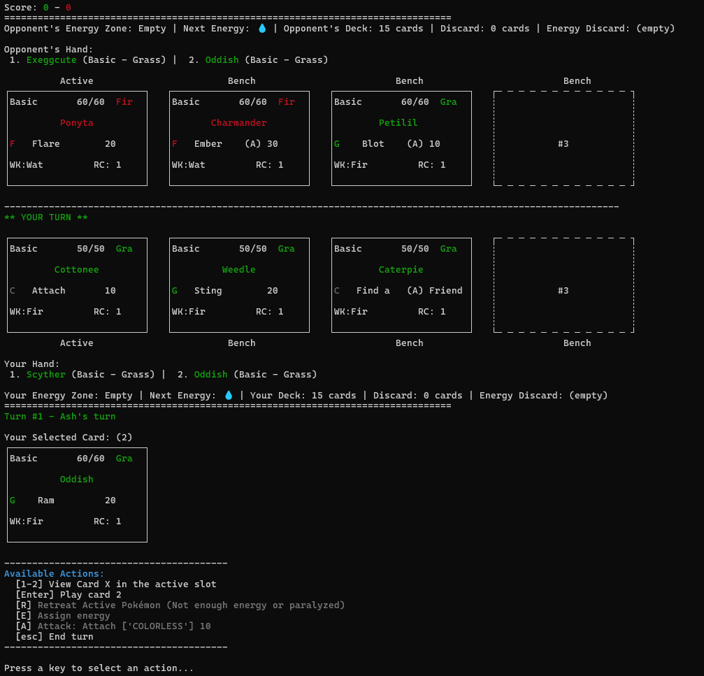

# 🃏 Pokémon Pocket TCG Simulator

 

Welcome to **Pokémon Pocket TCG Simulator**! This project aims to create a lightweight, scriptable, and extensible simulation of the Pokémon Trading Card Game (TCG) in Python. The goal is to provide a platform for:

- 🧪 **Testing deck ideas**
- 🤖 **Developing AI players**
- 🛠️ **Experimenting with custom rules**
- 📊 **Simulating matches for analysis**

> **Note:** This project is a **Work In Progress**. Many features are incomplete or missing, and the gameplay is not yet fully representative of the real Pokémon TCG.

---

## 🚀 Getting Started

### 1. **Clone the Repository**
```sh
git clone https://github.com/your-username/pokemon-pocket-tcg-sim.git
cd pokemon-pocket-tcg-sim
```

### 2. **Install Requirements**
Make sure you have Python 3.10+ installed.
```sh
pip install -r requirements.txt
```

### 3. **Run Example Gameplay**
You can run the main simulation or tests:
```sh
python test_manual_game.py
```

---

## 🖼️ Example Gameplay Screenshot



---

## 📦 Project Structure

```
├── src/                # Main source code
│   ├── deck_factory.py # Deck creation logic
│   ├── ...             # Other game modules
├── resources/          # Card data and resources
├── tests/              # Unit tests
├── screenshots/        # Example images
└── requirements.txt    # Python dependencies
```

---

## ⚠️ Project Status & Missing Features

- This is an **early-stage WIP**. Many features are missing or incomplete, including:
  - Full rules enforcement
  - Trainer/supporter cards
  - Abilities/Attack abilities
  - Evolutions
  - AI opponents
  - Comprehensive error handling

Contributions and feedback are welcome!

---

## 📚 License

This project is for educational and prototyping purposes. See `LICENSE` for details.

---

## 🙋‍♂️ Questions?
If you have questions or want to contribute, please open an issue or pull request!

---

*Happy dueling!*
